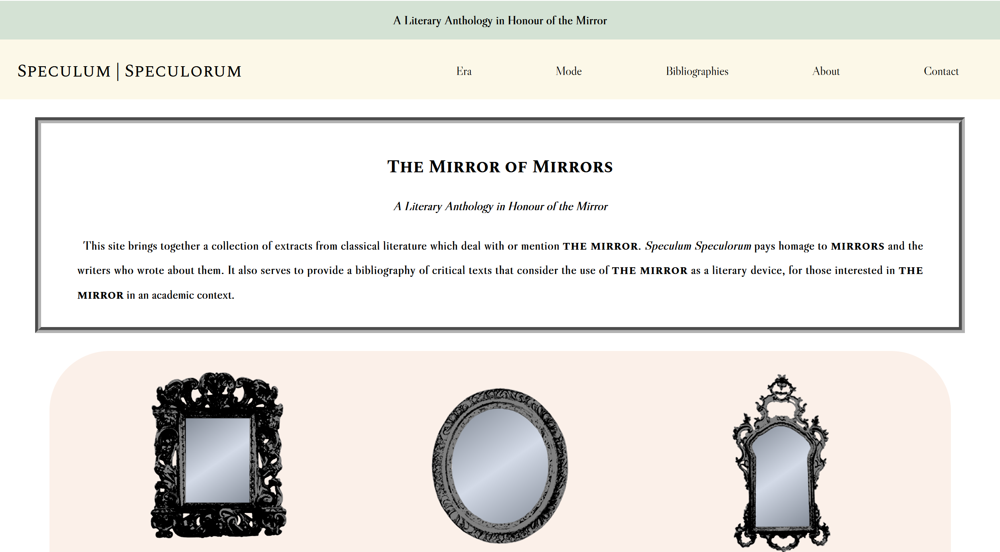
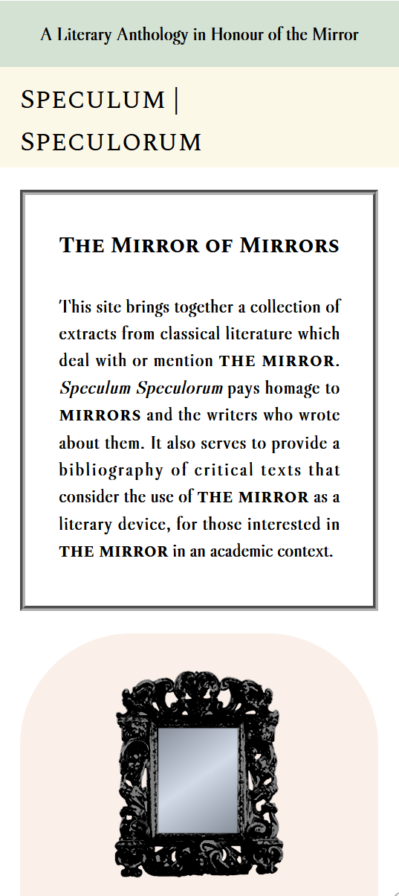
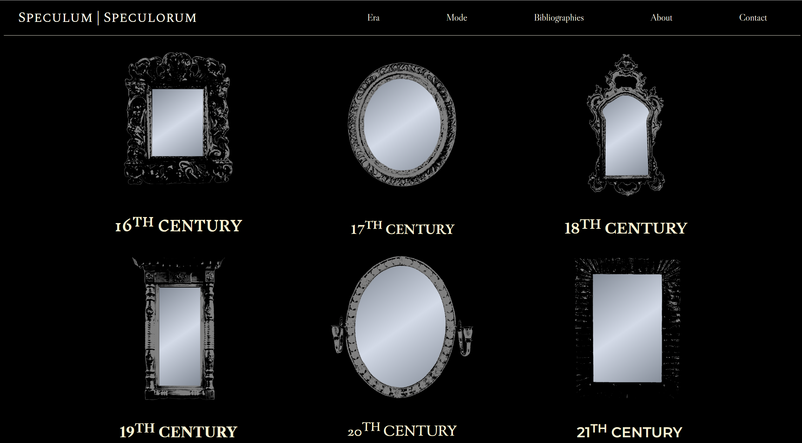
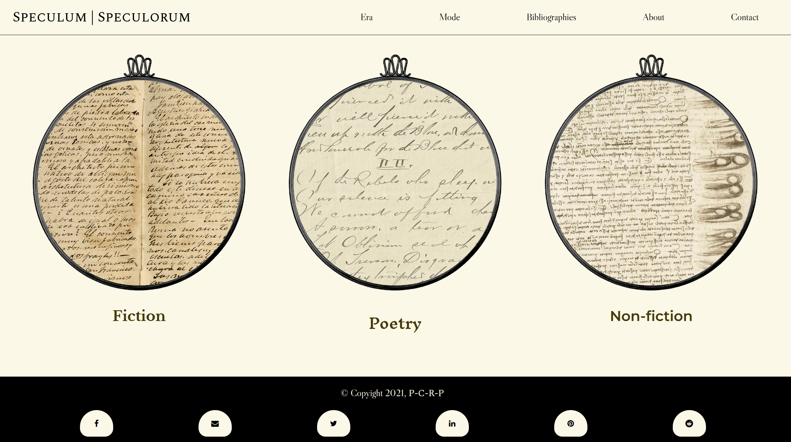
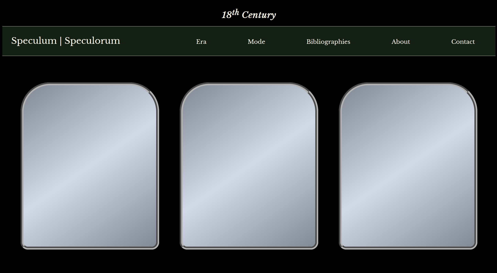
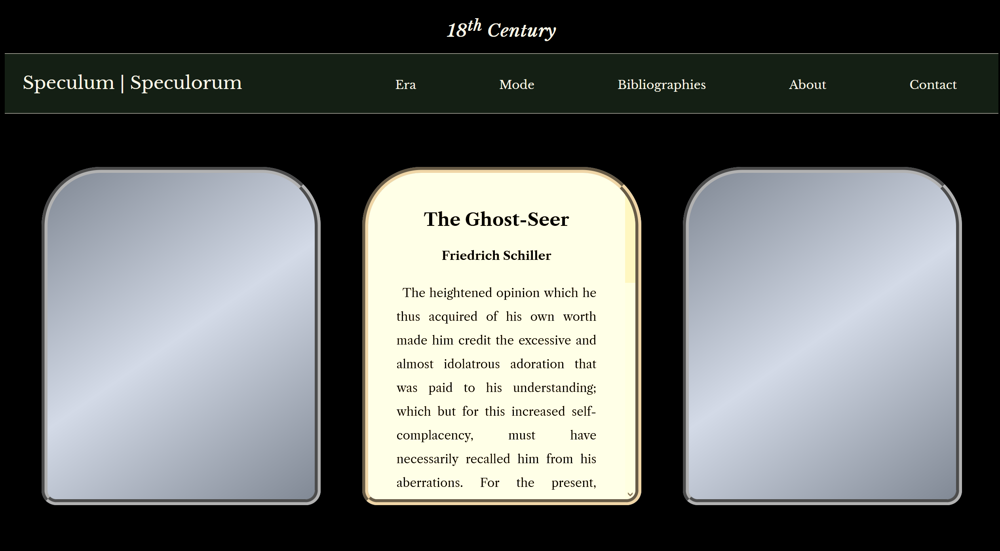
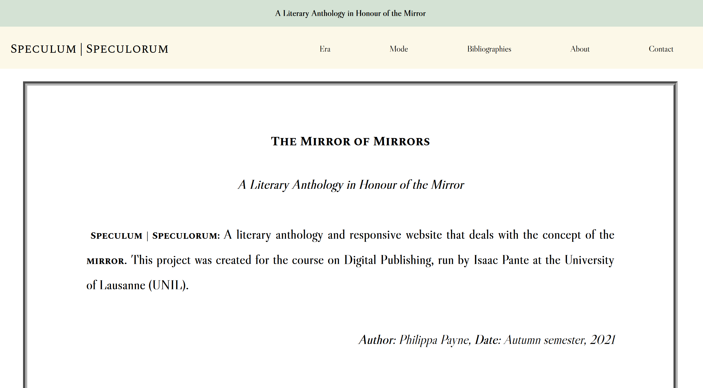
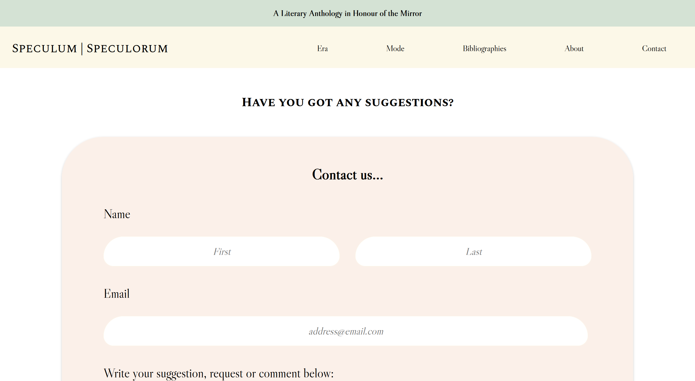
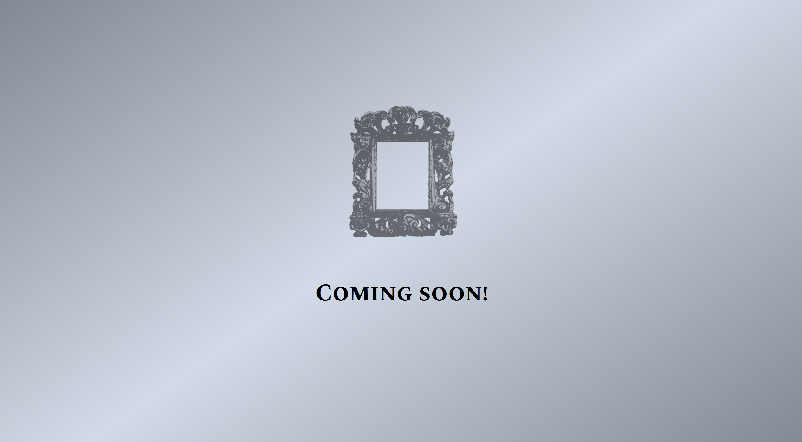

# Speculum | Speculorum

---

A literary anthology and responsive website that deals with the concept of the mirror. This project was created for the course on **Digital Publishing**, run by [Isaac Pante] at the [University of Lausanne] (UNIL).

**Author**: _Philippa Payne_ (<philippa.payne@unil.ch>)

**Date**: _Autumn semester, 2021_

<figure>
    
</figure>

---

## Description

This project aims to create a responsive website which collates excerpts from different pieces of classical literature from the 16th to the 20th centuries. The authors of these extracts would all use the concept of a **mirror** as a literary device or piece of imagery, to build the atmospheres and landscapes of their works. This project focuses on the **mirror** as an object which has become central to our sense of perception and self-reflection, yet has been relatively overlooked in literary criticism. By creating a literary anthology, accessible online, this digital publication hopes to rekindle people's fascination with the **mirror** and open up intellectual discussion on the use of the **mirror** as a literary device.

The following steps needed to be taken to facilitate this project:

1. Research which pieces of classical literature and which authors are known to include the concept of the **mirror** in their works.
2. Search for extracts from these texts and authors which use the concept of the **mirror**, saving these extracts to plain text (.txt) files.
3. Create a website where operators can browse by category, view bibliographies relating to the **mirror**, and submit feedback forms.
4. Add responsive elements to create an aesthetic around the **mirror** theme; allow the site to be accessible via different viewports.

### Why 'Speculum | Speculorum'?

The name of this project was inspired by a poem from the Middle Ages entitled 'Speculum Speculorum' - 'The Mirror of Mirrors'. The poem was written by the monk Nigellus Wireker. It is one of the earliest uses of the mirror as a device, used to highlight the 'folly' of vanity and self-discontent. The project considers itself, in a way, also to resemble - at least aesthetically - a 'mirror of mirrors' in that it reflects upon the reflections of other authors. 

---

## Objectives

This project was undertaken whilst the author was learning the fundamentals of HTML, CSS, and Javascript in the course on **Programming for the Internet**. Thus, the objectives of this project were set at a level that was conceived to be achievable in a matter of months, and on rudimentary knowledge of programming. The main objective of this project was, therefore, to practise and apply what had been learnt in these classes. The project would also be informed by the content of the **Digital Publishing** course, which gave a broad contextual overview of what is involved in digital publication.

As this project was of an experimental nature, the author chose to take a broad sweep of classical literature, using English language and translated texts (given that English is their maternal language), and mobilising texts available from [Project Gutenberg], which would naturally limit the collected extracts to more well-known or canonical authors.

It was also incredibly important to the creator to include more women's literature in the project, despite the limitations laid upon them by [Project Gutenberg]. This agenda seemed particularly important given that the mirror is so often viewed as a feminine object. How interesting it is, then, that it is male authors who have used the concept to such abundance.

### What were the central ideas of this project?

To use:

- ==CSS grid== within the website
- ==media queries== and ==CSS flexbox== to make the anthology accessible via different viewports
- ==iframe== to embed content (the extracts) within a page
- ==audio== clips within the website
- the ==:hover selector== to add responsivity to the site
- custom ==fonts== within the site
- the ==transform== and ==transition== attributes to add responsivity
- ==webkit== to add animation elements to page
- ==jQuery== for greater interactivity

To create:

- a drop down ==nav== bar
- a feedback ==form== where operators can submit reviews or suggestions to build the anthology
- a ==README file== to explain the project
- social media ==buttons== that link to shareable content

### What were the criterion for the literary corpus?

Texts would be:

- in the **English** language, or would have been translated into English
- available via [Project Gutenberg]
- from witihin the accepted literary **canon** (as defined by those texts available on [Project Gutenberg])
- from between the **16th and 20th centuries**, giving a broad overview of all periods
- *chosen based on their use of the central concept, aiming to reduce a dependency on cliché*

#### What texts are currently included?

- Hans Christian Andersen, 'The Snow Queen' (1844)
- L. Frank Baum, *The Enchanted Island of Yew* (1903)
- Theodore Dreiser, *Sister Carrie* (1900)
- Alexandre Dumas, *Vicomte de Bragelonne* (1847)
- Alexandre Dumas, *Marguerite de Valois* (1845)
- Ellen Glasgow, *Life and Gabriella* (1916)
- Sarah Grand, *The Heavenly Twins* (1893)
- Robert Graves, 'Mirror, mirror!' (1920)
- Emily Hahn, *Beginner's Luck* (1931)
- Sarah Orne Jewett, *Old Friends and New* (1879)
- Ada Leverson, *The Twelfth Hour* (1907)
- Katherine Mansfield, 'The Garden Party' (1922)
- Ann Radcliffe, *The Romance of the Forest* (1791)
- Friedrich Schiller, *The Ghost-Seer* (1787)
- Friedrich Schiller, 'Friendship' (1782)
- Bram Stoker, *Dracula* (1897)
- Bram Stoker, *The Man* (1905)
- Bram Stoker, *The Mystery of the Sea* (1902)
- Alfred, Lord Tennyson, 'The Lady of Shalott' (1832)
- Leo Tolstoy, *Anna Karenina* (1878)
- Oscar Wilde, 'Charmides' (1881)
- Yevgeny Zamyatin, *We* (1920)

---

## Overview

### Homepage

<figure>
    
</figure>

#### Media query responsivity (example):

<figure>
    
</figure>

### Eras

<figure>
    
</figure>

### Modes

<figure>
    
</figure>

### Extracts

<figure>
    
</figure>

#### Hover effect:

<figure>
    
</figure>

### Bibliographies

---

#### 
*COMING SOON*

---

### About

<figure>
    
</figure>

### Contact

<figure>
    
</figure>

### 'Coming Soon'

<figure>
    
</figure>

---

## Features

- CSS grid
- media queries
- CSS flexbox
- iframe
- :hover selector
- custom fonts
- transform
- transition
- webkit
- nav bar
- form
- README file
- social media buttons

### *Under development:*
- audio clips
- transform
- jQuery
- drop down nav

## Diary

### Stage 1:

| 20.11.21 | Research* | 3h |
| 21.11.21 | Research | 3h |
| 22.11.21 | Research | 3h |
| 23.11.21 | Research | 3h |

| 26.11.21 | Research | 3h |
| 27.11.21 | Research | 3h |

| 03.12.21 | Research | 3h |
| 04.12.21 | Research | 3h |
| 05.12.21 | Research | 3h |

==*I did not anticipate how long it would take to research these texts - this process ended up taking most of my time on this project.==

### Stage 2:

| 27.11.21 | Design planning | 3h |
| 28.11.21 | Design planning | 3h |
| 29.11.21 | Design planning | 3h |

### Stage 3:

| 05.12.21 | Photoshopping | 3h |

### Stage 4:

| 11.12.21 | Homepage | 5h |
| 12.12.21 | Homepage | 5h |

| 18.12.21 | Homepage | 5h |
| 19.12.21 | Eras | 3h |

| 14.01.22 | Modes | 3h |

| 17.01.22 | Extracts | 5h |
| 18.01.22 | About, Contact, Coming Soon | 5h |
| 19.01.22 | README file | 2h |

## Future

This project can clearly be developed further, given more time, and has a lot of potential.

The author has defined several goals for the advancement of the project:

1. Create a **French and German version** of the site which hosts texts in their original languages
2. Expand the available **non-fiction works**, to capture a different audience
3. Include works from the **21th century**
4. Design own **illustrations** for use on the website, to replace current images
5. Improve accessibility, by adding more **viewport options**
6. Expand the extracts to include the use of the term **'looking-glass'** and the verb **'to mirror'**
7. Allow people to make **creative writing submissions** about the mirror for the 21th century section
8. Create an **opening transition**, effect or graphic, to build the aesthetic and ambience of site
9. Add a **search** component to the site
10. **Include more extracts for each section**
11. Automise the process of locating abstracts using **Python**
12. Add **pages** for bibliographies and individual modes
13. Integrate more **JavaScript** and jQuery into site
14. Create new modes section for **plays**
15. Do more research into **fonts** to create more contextual aesthetic for era sections
16. Add **drop down** navigation bar component

## Acknowledgements

Thanks to [Isaac Pante] for his help in defining the objectives of this project and the scope of the site.

## References

- Andersen, Hans Christian, 'The Snow Queen' (1844)
- Baum, L. Frank, *The Enchanted Island of Yew* (1903)
- Dreiser, Theodore, *Sister Carrie* (1900)
- Dumas, Alexandre, *Vicomte de Bragelonne* (1847)
- Dumas, Alexandre, *Marguerite de Valois* (1845)
- Glasgow, Ellen, *Life and Gabriella* (1916)
- Grand, Sarah, *The Heavenly Twins* (1893)
- Graves, Robert, 'Mirror, mirror!' (1920)
- Hahn, Emily, *Beginner's Luck* (1931)
- Jewett, Sarah Orne, *Old Friends and New* (1879)
- Leverson, Ada, *The Twelfth Hour* (1907)
- Mansfield, Katherine, 'The Garden Party' (1922)
- Radcliffe, Ann, *The Romance of the Forest* (1791)
- Schiller, Friedrich, *The Ghost-Seer* (1787)
- Schiller, Friedrich, 'Friendship' (1782)
- Stoker, Bram, *Dracula* (1897)
- Stoker, Bram, *The Man* (1905)
- Stoker, Bram, *The Mystery of the Sea* (1902)
- Tennyson, Alfred, Lord, 'The Lady of Shalott' (1832)
- Tolstoy, Leo, *Anna Karenina* (1878)
- Wilde, Oscar, 'Charmides' (1881)
- Zamyatin, Yevgeny, *We* (1920)

- La Belle, Jenijoy, *Herself beheld: the literature of the looking glass* (London: Cornell University Press, 1988).
- Mullan, John, 'Ten of the best mirrors in literature', *The Guardian* (2010), [source].

[Project Gutenberg]: https://www.gutenberg.org/
[isaac pante]: https://github.com/ipante
[university of lausanne]: https://www.unil.ch/central/en/home.html
[source]:https://www.theguardian.com/books/2010/oct/30/john-mullan-mirrors-literature-review